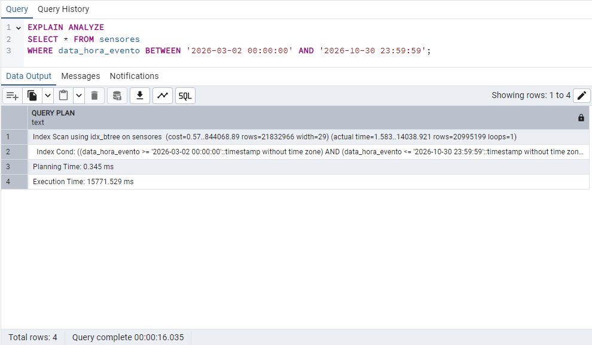
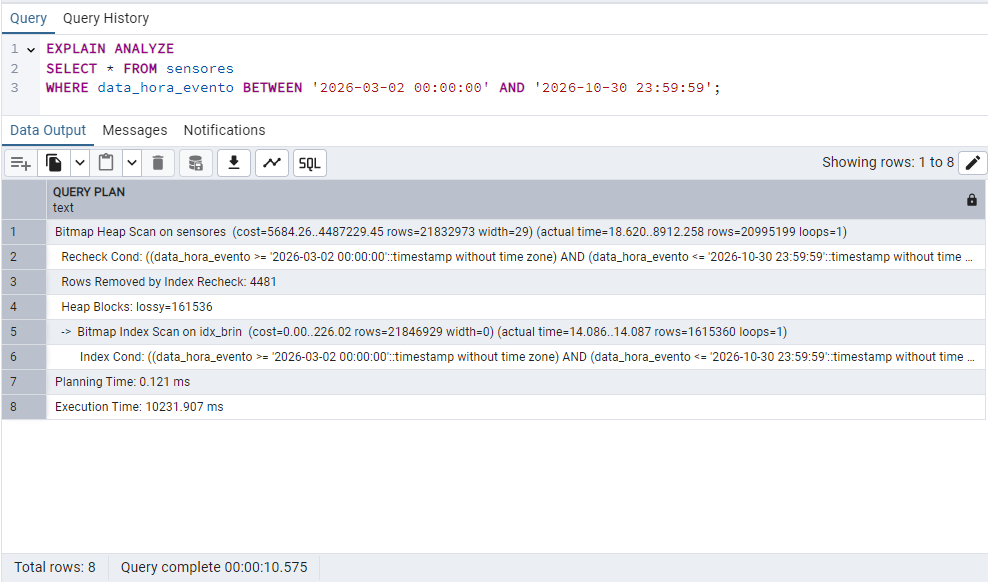

## Sumário

- [Objetivo](#objetivo)
- [Estrutura do Projeto](#estrutura-do-projeto)
- [Entendendo o que são Índices e comparando B-Tree (padrão) com BRIN](#entendendo-o-que-são-índices-e-comparando-b-tree-padrão-com-brin)
- [Demonstração Prática](#demonstração-prática)
- [Consultas com EXPLAIN ANALYZE](#consultas-com-explain-analyze)
- [Análise Comparativa](#análise-comparativa)
- [Comparando o Armazenamento em Disco](#comparando-o-armazenamento-em-disco)
- [Conclusão](#conclusão)
- [Quando usar Índice BRIN?](#quando-usar-índice-brin)
- [Referências](#referências)

# Estudo sobre Índice BRIN
Atividade de Programação e Administração de Banco de Dados — Este projeto demonstra o uso prático do índice BRIN em grandes bases de dados, comparando seu desempenho e consumo de espaço com o índice B-Tree no PostgreSQL.

## Objetivo

Demonstrar, de forma prática e comparativa, o funcionamento do índice **BRIN (Block Range Index)** em cenários com bilhões de registros, explicando:

- O que são índices no PostgreSQL
- Diferenças entre **BRIN** e **B-Tree**
- Casos em que o BRIN é mais vantajoso
- Ganhos em desempenho e economia de espaço em disco

## Estrutura do Projeto

- Criação da tabela de sensores
- Inserção de dados com `generate_series`
- Criação e remoção dos índices B-Tree e BRIN
- Consultas com e sem índice, usando `EXPLAIN ANALYZE`
- Prints das execuções para comparação de desempenho
- Tabela com os tamanhos dos índices em diferentes volumes

## Entendendo o que são Índices e comparando B-Tree (padrão) com BRIN.

### O que é um índice?

Um **índice** é uma estrutura auxiliar que acelera a busca por dados em tabelas. Funciona como o índice de um livro: ao invés de ler todas as páginas (linhas da tabela), você vai direto ao ponto.

### Índice B-Tree

- Organiza os dados de forma ordenada
- Ideal para buscas específicas ou intervalos pequenos
- Mais preciso, mas consome muito espaço

### Índice BRIN

- Divide a tabela em **blocos de páginas** (por exemplo, de 128KB)
- Armazena o **mínimo e máximo** de cada bloco para a coluna indexada
- Ideal para dados **ordenados fisicamente** (ex: logs, datas)
- Extremamente leve

---

## Demonstração Prática

### Criação da Tabela

```sql
CREATE TABLE sensores (
  id SERIAL PRIMARY KEY,
  data_hora_evento TIMESTAMP,
  tipo TEXT,
  valor DOUBLE PRECISION
);
```
### Resumo dos campos:
- **id**: identificador único de cada registro.
- **data_hora_evento**: registra quando o dado foi coletado.
- **tipo**: tipo do sensor (temperatura, umidade, etc).
- **valor**: valor da leitura do sensor.

### Inserindo os dados
```sql
INSERT INTO sensores (data_hora_evento, tipo, valor)
SELECT 
    NOW() + (s * INTERVAL '1 second'),
    CASE 
        WHEN s % 3 = 0 THEN 'temperatura'
        WHEN s % 3 = 1 THEN 'umidade'
        ELSE 'pressao'
    END,
    CASE 
        WHEN s % 3 = 0 THEN 20 + random() * 15
        WHEN s % 3 = 1 THEN 40 + random() * 60
        ELSE 980 + random() * 40
    END
FROM generate_series(1, 200000000) AS s;
```
 **⚠️ Atenção:** Este script insere 200 milhões de registros simulados, o que pode levar um tempo considerável para ser executado.
Se seu computador não tiver espaço ou capacidade suficiente, recomendamos diminuir a quantidade de dados gerados.

## Consultas com EXPLAIN ANALYZE

### Sem índice (Sequential Scan)

- Leitura completa da tabela  
- Muito lento para grandes volumes

Sem índice, o banco de dados realiza uma varredura sequencial, o que compromete o desempenho das consultas.  
A criação de um índice B-Tree melhora consideravelmente a velocidade ao buscar por colunas indexadas, como `data_hora_evento`.

## Criar e Medir Índice B-Tree
```sql
CREATE INDEX idx_btree ON sensores (data_hora_evento);
SELECT pg_size_pretty(pg_relation_size('idx_btree'));
```
Após a criação do índice, o segundo comando retorna o espaço ocupado por ele no disco.
Com 200 milhões de registros, o índice B-Tree gerado ocupou aproximadamente 4284 MB (ou 4,284 GB).

### Consulta com Índice B-Tree

```sql
EXPLAIN ANALYZE
SELECT * FROM sensores
WHERE data_hora_evento BETWEEN '2026-03-02 00:00:00' AND '2026-10-30 23:59:59';
```

### O resultado do `EXPLAIN ANALYZE`

🕒 Tempo de execução: entre 15 a 20 segundos.


## Consulta com Índice BRIN

### Remover o índice B-Tree existente
```sql
DROP INDEX idx_btree;
```
### Criar e Medir Índice BRIN
```sql
CREATE INDEX idx_brin ON sensores USING BRIN (data_hora_evento);
SELECT pg_size_pretty(pg_relation_size('idx_brin'));
```
Após a criação do índice, o segundo comando retorna o espaço ocupado por ele no disco.
Com 200 milhões de registros, o índice BRIN gerado ocupou aproximadamente 416 kB.

### Executar a consulta para análise de desempenho
```sql
EXPLAIN ANALYZE
SELECT * FROM sensores
WHERE data_hora_evento BETWEEN '2026-03-02 00:00:00' AND '2026-10-30 23:59:59';
```

### O resultado do `EXPLAIN ANALYZE`

🕒 Tempo de execução: entre 10 a 12 segundos.

## Análise Comparativa
O resultado do `EXPLAIN ANALYZE` fornece dados importantes para comparar o desempenho dos índices BRIN e B-Tree em consultas sobre grandes volumes de dados.
Para facilitar a compreensão, criei a tabela abaixo que resume a performance de cada índice.

| Critério                 | **BRIN**         | **B-Tree**      | Melhor     |
| ------------------------ | ---------------- | --------------- | ---------- |
| **Tipo de leitura**      | Bitmap Heap Scan | Index Scan      | Depende    |
| **Blocos lidos (lossy)** | 161.536 blocos   | Linhas precisas | BRIN       |
| **Linhas retornadas**    | 20.995.199       | 20.995.199      | Igual      |
| **Planejamento**         | 0.121 ms         | 0.345 ms        | BRIN       |
| **Tempo total**          | 10.2 segundos    | 15.8 segundos   | BRIN       |

Em algumas situações, consultas específicas podem se beneficiar mais do índice B-Tree, principalmente quando a precisão na leitura de dados é prioritária.  
O índice BRIN, por sua vez, é uma estrutura leve que funciona muito bem para tabelas gigantes com dados ordenados fisicamente, sendo bastante usado em cenários como logs de sensores e dados temporais com inserção sequencial.

## Comparando o Armazenamento em Disco

A tabela abaixo mostra a diferença de espaço ocupado pelos índices B-Tree e BRIN em diferentes volumes de dados:

| Total de Registros | Tamanho do Índice B-Tree | Tamanho do Índice BRIN | Diferença (aproximadamente) |
|--------------------|---------------------------|--------------------------|------------------------------|
| 10 milhões         | 214 MB                    | 40 KB                   | 5.486x menor                 |
| 20 milhões         | 428 MB                    | 56 KB                   | 7.821x menor                 |
| 80 milhões         | 1.714 MB                  | 176 KB                  | 9.738x menor                 |
| 200 milhões        | 4.284 MB                  | 416 KB                  | 10.295x menor                |

O índice BRIN economiza significativamente mais espaço conforme a quantidade de dados aumenta, ideal para grandes volumes com dados sequenciais.

## Conclusão

- O índice **BRIN** não substitui o **B-Tree** em todos os casos, mas é excelente para tabelas muito grandes com colunas ordenadas.
- É ideal para logs de sensores, dados temporais e cenários de inserção sequencial.
- Proporciona um ganho significativo de espaço, reduzindo o tamanho do índice de centenas de MB para poucos KB.
- Melhora consideravelmente o tempo de resposta em consultas por intervalo de dados.

### Quando usar Índice BRIN?

- Quando os dados possuem ordem física natural (ex: por data ou ID sequencial)
- Para consultas que filtram por intervalos grandes
- Em situações que exigem economia de espaço no armazenamento de índices

## Referências

- Documentação oficial do PostgreSQL sobre Índices BRIN:  
  [https://www.postgresql.org/docs/current/brin.html](https://www.postgresql.org/docs/current/brin.html)

- Documentação oficial do PostgreSQL sobre Índices B-Tree:  
  [https://www.postgresql.org/docs/current/btree.html](https://www.postgresql.org/docs/current/btree.html)

